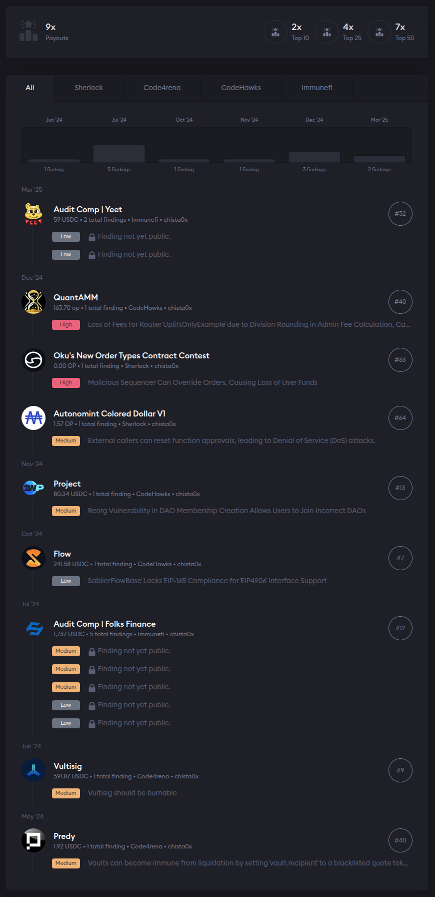

<h1 align="center">Hi 👋, I'm Ebrahim Karimi (EbiPenMan/Chista0x)</h1>
<h3 align="center">Software Engineer | Game Developer | Blockchain Auditor | Security Researcher</h3>

  

- 🌱 I’m currently learning **Solana | Rust**

- 👨‍💻 All of my projects are available at [http://ebipenman.github.io/](http://ebipenman.github.io/)

- 💬 Ask me about **Solidity | Ethereum | Security**

- 📫 How to reach me **karimi.gamedev@gmail.com | chista0x@gmail.com**

<h3 align="left">Connect with me:</h3>

<!--  -->

<!--  -->

<!--  -->
<!--  -->

### Blog posts
- [Unity3D Modular Development Principle (UMDP): Revolutionizing Collaborative Game Development](https://ebrahim-karimi.medium.com/unity3d-modular-development-principle-umdp-revolutionizing-collaborative-game-development-0de10e2c4652)
- [Why Participate in Web3 Bug Bounties and Contests?](https://www.linkedin.com/feed/update/urn:li:activity:7218726150561230849/)

---

### My Audits Profile: <a href="https://audits.sherlock.xyz/watson/chista0x" target="blank"> Chista0x </a>

---

### Blockchain Stack
| Name       |
| ---------- |
| Solidity   |
| Yul - Assembly   |
| Rust       |
| Ethereum   |
| Solana     |
| Substrate   |
| Cosmos SDK  |
| EVM         |
| Hardhat       |
| Foundry       |

### Programming Languages

| Name       |
| ---------- |
| Solidity   |
| Yul - Assembly   |
| Rust       |
| C++        |
| C#         |
| Java       |
| JavaScript |
| TypeScript |
| Python     |
---

### Frameworks & Libraries

| Name       |
| ---------- |
| Express.js |
| NestJS     |
| Spring     |
| OpenCV     |
| Mocha      |

---

### Web Technologies

| Name  |
| ----- |
| HTML5 |
| CSS3  |
| Reactjs  |

---

### Databases & Storage

| Name               |
| ------------------ |
| Cassandra          |
| Elasticsearch      |
| Firebase           |
| MongoDB            |
| MSSQL (SQL Server) |
| MySQL              |
| PostgreSQL         |
| Redis              |
| SQLite             |

---

### DevOps & Tools

| Name       |
| ---------- |
| Git        |
| Docker     |
| Kubernetes |
| Grafana    |
| Postman    |
| Linux (OS) |

---

### Cloud Services

| Name                  |
| --------------------- |
| AWS
| Google Cloud Platform |
| Firebase              |

---

### Data & Messaging

| Name          |
| ------------- |
| Kafka         |
| Elasticsearch |

---

### Desktop & Graphics

| Name      |
| --------- |
| Blender   |
| Photoshop |

---

### Game Engines

| Name          |
| ------------- |
| Unity         |
| Unreal Engine |
| Cocos Creator |

---

### Mobile & Hardware

| Name    |
| ------- |
| Android |
| ios |
| Arduino |

---

  

<h3 align="left">Support:</h3>

  
